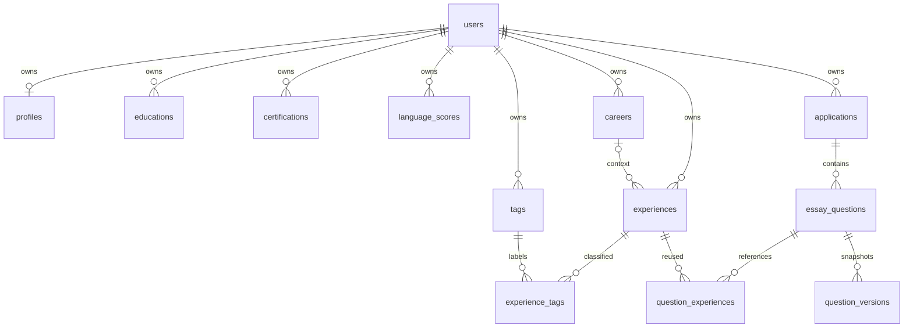

# 써랍 데이터·API 설계서

작성일: 2026-09-16 · 버전: 1.2 · 실행 범위: 로컬 전용

## 1. 범위와 현재 상태

써랍은 신입 취업 준비생이 기본 이력과 경험을 정리하고, 회사별 자소서를 직접 작성할 때 재사용하는 개인 기록 서비스다. 인턴 및 기타 근무 경력을 포함한다. 자소서 답변 자동 생성은 제공하지 않는다.

이번 산출물은 ① 엔터티·필드·관계·삭제 규칙 ② DBML ③ 화면별 API 및 요청·응답 명세다. 백엔드, DB 인스턴스, 로그인, 실제 AI 연결은 구현하지 않았다. 현재 Vue는 예시 데이터와 브라우저 `localStorage`를 사용해 새로고침 후에도 작성 내용을 복원한다. 이는 서버 영속 저장이 아니라 현재 기기에만 남는 임시 저장이다.

- 데이터 기준: `ssulap-DB.dbml`
- API 기준: `ssulap-API.yml` (OpenAPI 3.0.3)
- 화면별 동작 목록: `ssulap-api-catalog.md`
- 전체 필드 설명·화면 매핑: `ssulap-data-dictionary.md`
- 검증 결과: `ssulap-validation.json`

산출물의 파일명은 작업용이다. 제출 시 확인된 반·고유번호·이름을 넣어 `{반}_{고유번호}_{이름}_써랍-API.yml`, `{반}_{고유번호}_{이름}_써랍-DB.dbml`로 변경한다. 고유번호와 이름은 추정해 넣지 않았다.

## 2. 설계 결정

1. 13개 테이블로 구성한다. 단순 분류마다 테이블을 추가하지 않고, 여러 건을 관리하거나 실제 관계를 갖는 정보만 분리한다.
2. 학력·자격증·어학·경력은 복수 등록한다. 병역·보훈·장애사항은 사용자별 단일 프로필이다.
3. 지원 건 하나가 자소서 한 묶음이다. 회사·직무·지원 시기가 같아도 재지원 또는 별도 지원 건을 허용한다. 회사명은 외부 기업 DB 없이 문자열로 보관한다.
4. 문항과 현재 답변은 한 테이블로 묶고, 사용자가 직접 저장한 답변 이력은 question_versions에 불변 스냅샷으로 보관한다. 자동 저장은 버전을 만들지 않는다.
5. 경험에는 경력을 선택적으로 연결한다. 경험–태그, 문항–경험은 다대다 연결 테이블을 둔다.
6. 협업 회고는 경험의 선택 텍스트 필드다. 팀원 계정·실명·평점·후기 테이블은 만들지 않는다.
7. 로컬 개발에서는 서버가 고정 사용자 1을 선택한다. 클라이언트는 userId를 보내지 않는다. 본인 소유 검증은 서비스 계층에서 유지하고, 로그인 구현은 후속 범위로 둔다. 이는 인증이 구현됐다는 의미가 아니다.
8. 실제 AI 추천은 확장 계약이다. 구현 전에는 501로 명확히 알리고 수동 경험 찾기를 제공한다. 현재 프론트의 태그 시연과 구분한다.

## 3. 엔터티와 관계

| 엔터티 | 역할 | 관계 |
|---|---|---|
| users | 사용자 식별·표시명 | 모든 개인 자료의 소유자 |
| profiles | 병역·보훈·장애 및 추가 정보 | users와 1:0..1, 로컬 초기화 시 생성 |
| educations | 학력·학점 | 사용자 1:N |
| certifications | 자격증 | 사용자 1:N |
| language_scores | 어학 | 사용자 1:N |
| careers | 근무 경력 | 사용자 1:N, 경험과 1:N |
| experiences | 경험 및 협업 회고 | 사용자 1:N, 경력 선택 연결 |
| tags | 사용자별 경험 분류 | 사용자 1:N |
| experience_tags | 경험–태그 연결 | N:M, 복합 PK |
| applications | 지원 건·자소서 묶음 | 사용자 1:N |
| essay_questions | 문항·현재 답변 | 지원 건 1:N |
| question_versions | 문항 답변 스냅샷 | 문항 1:N, 상태별 개수 제한 |
| question_experiences | 참고 경험 연결 | 문항–경험 N:M, 복합 PK |



## 4. 타입·입력 규칙

### 공통

- API camelCase, DB snake_case. ID는 bigint PK이며 API는 JS 안전 정수 범위 내 양의 정수로 제한한다.
- 월 정보는 `YYYY-MM` / DB `char(7)`로 저장한다. 일자가 필요한 자격 취득일·어학 응시일은 `YYYY-MM-DD` / DB `date`다.
- 월 형식은 서버에서 실제 연월로 파싱하고 0001~9999년만 허용한다. 시작과 종료가 모두 있으면 시작 <= 종료.
- createdAt/updatedAt은 서버 관리 UTC ISO-8601. 프론트에서 Asia/Seoul로 표시한다. updated_at 갱신은 서비스가 담당하며 DB default만으로 갱신되지는 않는다.
- PUT은 전체 대체. 모든 쓰기 키를 보내고, 선택 항목은 null로 보낸다. required와 nullable은 별개다. POST도 동일 쓰기 스키마를 사용해 기본값은 UI에서 명시한다.
- 이름·제목·회사·직무·지원 시기·태그는 양끝 공백 제거. 필수 문자열은 공백만 입력하면 400. 선택 문자열의 빈 값은 null로 정규화한다. 문항·답변은 문장 공백을 보존하며 빈 문자열을 허용한다.
- 소수 학점은 최대 소수점 둘째 자리까지 허용하며 추가 자릿수는 400. gpa와 gpaScale은 함께 입력하거나 둘 다 null. gpaScale은 4.0/4.3/4.5/5.0/100.0 중 하나, 0 <= gpa <= gpaScale.
- 미래 날짜는 졸업 예정·어학 유효기간 등에서 허용한다. 실제 날짜 유효성 및 시작/종료 순서는 검증한다.
- nullable 날짜는 미확정 상태를 허용한다. 경력 재직 중이면 endMonth는 null. 미재직이면서 종료월 미입력도 초안으로 허용한다.

### 상태 값

| 화면 값 | API 값 |
|---|---|
| 작성 중 / 작성 완료 / 제출 완료 | DRAFT / COMPLETED / SUBMITTED |
| 재학 / 휴학 / 졸업 예정 / 졸업 | ENROLLED / ON_LEAVE / EXPECTED_GRADUATION / GRADUATED |
| 인턴 / 정규직 / 계약직 / 아르바이트 / 기타 | INTERN / FULL_TIME / CONTRACT / PART_TIME / OTHER |
| 병역 미입력 / 해당 없음 / 미필 / 복무 중 / 군필 / 면제 | UNSPECIFIED / NOT_APPLICABLE / NOT_SERVED / SERVING / COMPLETED / EXEMPT |
| 보훈·장애 미입력 / 대상 / 비대상 | UNSPECIFIED / YES / NO |

자소서 상태는 DRAFT ↔ COMPLETED ↔ SUBMITTED 인접 전이만 허용한다. COMPLETED는 모든 문항이 명시적으로 완료되고 제한 이하여야 한다. 문항 완료는 답변 유무에서 추론하지 않고 사용자가 버튼으로 결정한다. SUBMITTED는 외부 기업에 전송했다는 시스템 증명이 아니다.

### 프로필 조건

- 병역 SERVING일 때 종료월은 null. COMPLETED일 때 시작·종료월 입력을 권장하되 초안 저장을 위해 필수화하지 않는다.
- 군별·계급·복무 기간은 SERVING 또는 COMPLETED에서만 입력한다. 다른 상태로 바꾸면 UI에서 값을 지우고 서버는 남은 세부값이 있으면 400으로 응답한다.
- 보훈·장애는 UNSPECIFIED와 NO를 구분한다. additionalInfo는 선택 메모이며 별도의 증명서·파일·식별번호는 수집하지 않는다.
- 기본 이력과 민감 항목은 경험 추천 요청·응답에 포함하지 않는다.

### 태그

- 경험당 최대 10개, 태그당 1~30자. 양끝 공백 제거, 동일 이름 중복 제거 후 저장한다.
- `(user_id, name)` 유일성으로 사용자 간 태그가 섞이지 않는다. 대소문자는 구분하며 같은 사용자 이름은 재사용한다.
- 쓰지 않는 태그는 보존한다. 독립 태그 CRUD는 제공하지 않는다. GET /tags는 보존된 태그도 반환하므로 선택했을 때 결과가 0건일 수 있다.

### 문항·글자 수

- 문항은 최대 2,000자, 답변은 최대 30,000자. 글자 수 제한은 1~20,000자다.
- 글자 수 제한을 넘는 답변도 초안으로 저장하고 overLimit=true를 표시한다.
- CRLF/CR을 LF로 정규화한 후 Unicode code point 수를 센다. 공백·줄바꿈 포함. 향후 Java는 codePointCount, Vue는 Array.from(answer).length를 사용한다. 현재 Vue의 문자열 length는 이에 맞게 교체해야 한다.
- 자소서 내 position은 1~1,000이며 중복 불가. 추가 시 max(position)+1, 삭제 시 기존 순서는 유지한다. 순서 교환 기능은 범위 밖이며 충돌은 409다.
- 자소서 생성 시 빈 문항 1개를 함께 생성한다. 이후 마지막 문항 삭제는 허용하므로 UI에 빈 문항 추가 상태가 필요하다.
- 문항 완료 상태는 DRAFT/COMPLETED다. 완료 후 문항·답변·제한을 수정하면 DRAFT로 되돌리고 사용자가 다시 완료해야 한다.

## 5. 삭제 규칙과 트랜잭션

| 작업 | 처리 | 원자적 처리 범위 |
|---|---|---|
| 경력 삭제 | experiences.career_id를 null로, 경험 보존 | 경력 삭제 + 연결 해제 |
| 경험 삭제 | 태그 연결·문항 연결 삭제, 태그 원본과 답변 유지 | 경험 + 두 연결 테이블 |
| 지원 건 삭제 | 문항과 참고 경험 연결 삭제, 경험 원본 유지 | 지원 건 + 문항 + 연결 |
| 문항 삭제 | 참고 연결 삭제, 경험 원본 유지 | 문항 + 연결 |
| 자소서 작성 완료 | 완료 버전 생성, 제출 버전 1개·완료 버전·최근 작업 버전 5개 보관 | 상태 변경 + 버전 생성·정리 |
| 자소서 제출 완료 | 제출 버전 생성 후 해당 버전 1개만 보관 | 상태 변경 + 버전 생성·정리 |
| 과거 버전 복원 | 선택 버전을 현재 초안에 적용하고 완료 상태를 DRAFT로 변경 | 현재 문항 갱신 |
| 직접 저장 버전 삭제 | MANUAL 버전만 삭제, 완료본·제출본은 보존 | 단일 버전 삭제 |
| 경험 등록·수정 | 필드 저장 + 태그 생성/재사용 + 연결 대체 | 전체 작업 하나 |
| 지원 건 생성 | 지원 정보 + 빈 첫 문항 | 전체 작업 하나 |
| 참고 경험 연결 | 문항·경험의 본인 소유 확인 후 중복 없이 저장 | 한 연결 작업 |
| 학력·자격증·어학 삭제 | 해당 항목만 삭제 | 단일 항목 |

- 모든 삭제는 하드 삭제다. UI에 확인창을 둔다. 휴지통·복구는 범위 밖.
- 사용자 삭제 API는 제공하지 않는다. users의 cascade는 로컬 데이터 정리 시 일관성을 위한 구조다.
- 연결 대상의 존재 및 동일 사용자 소유 여부는 서비스에서 확인한다. FK는 존재를 보장하지만 서로 다른 테이블의 사용자 일치까지 보장하지 않는다.
- 다른 사용자 소유와 없는 ID는 모두 404. 사용자 ID나 원본 내용을 오류에 노출하지 않는다.
- 같은 참고 연결의 PUT/DELETE는 멱등이며 204. 다만 양쪽 원본 리소스가 존재하고 본인 소유인지는 확인한다.
- 문항 순서 유일성 위반은 409. 태그 이름 동시 생성 충돌은 기존 행을 재조회해 재사용한다.
- API 요청 단위로만 트랜잭션을 묶는다. 서로 다른 기본 이력 구역이나 지원 정보와 답변 저장은 별도 요청이며 부분 성공을 UI에서 구분한다.
- 파일 삭제/외부 API/AI 호출을 CRUD 트랜잭션에 포함하지 않는다. 자동 저장은 마지막 입력 후 2초 동안 추가 변경이 없을 때 현재 초안을 덮어쓰는 디바운스 방식이며 버전을 생성하지 않는다. 화면 이동 시에는 즉시 저장한다. 동시 편집·낙관적 잠금은 후속 범위다.

## 6. 화면과 API의 연결

| 화면 | 주 데이터 | API |
|---|---|---|
| 공통 사용자 표시 | users | GET /me |
| 기본 이력 | profiles + 학력/자격증/어학 배열 | GET /me/resume, PUT /me/profile, 하위 항목 CRUD |
| 경력 | careers | /careers CRUD |
| 경험 | experiences + tags | /experiences CRUD, GET /tags |
| 보관함 | applications | /applications CRUD, q/status 필터 |
| 자소서 작성 | applications + essay_questions + question_versions | GET /applications/{id}, 문항 CRUD, 완료·상태·버전 API |
| 참고 경험 패널 | experiences + question_experiences | 경험 목록/상세, 연결 PUT/DELETE |
| 추천 패널 | 경험·태그 기반 계약 | POST /experience-recommendations (확장) |

목록은 개인 자료 규모를 전제로 전체 배열을 반환한다. 수정일 내림차순, id 내림차순이며 문항만 position 오름차순이다. 빈 결과는 200 + []이며 검색 실패로 처리하지 않는다.

## 7. 현재 Vue와 설계의 차이 (향후 변경 목록)

| 현재 필드·동작 | 설계 기준 | 필요한 화면 수정 |
|---|---|---|
| profile.school/major/gpa 등 단일 객체 | educations 배열 | 학력 여러 건 추가·수정·삭제 |
| 학력 내부 수강 과목 배열 | 현재 DB/API에 없음 | 수강 과목 저장 구조와 API 추가 |
| certifications/language_scores 배열 입력 | certifications/language_scores 배열 | 저장 API 연결 및 실패 표시 |
| 구역별 메모리 저장 버튼 | 구역별 저장 API | API 성공 후 반영 및 실패 표시 |
| career.role | department + jobTitle | 부서·직무 입력 분리 |
| experience.period 자유 텍스트 | startMonth + endMonth | 월 선택 필드로 교체 |
| experience.career 회사명 | careerId | 같은 회사의 다른 경력도 ID로 구분 |
| experience.memo | collaborationMemo | 이름 매핑, 기존 메모 유지 |
| tags 문자열 배열 | 쓰기 문자열 배열 / 읽기 Tag 객체 배열 | 선택 ID와 표시명 분리 |
| essays의 중첩 questions | applications + essay_questions | 상세 조회 결과를 편집 상태에 반영 |
| 한국어 상태 값 | 영문 enum | 화면 라벨과 API 값 매핑 |
| answer.length | 서버 계산 characterCount | 코드 포인트 기준으로 통일 |
| Vue 상태 + localStorage 2초 디바운스 자동 저장 | PUT 문항 초안 + 별도 버전·상태 API | 현재는 같은 저장·보관 정책을 브라우저에서 시연, 추후 API 성공 기준으로 전환 |
| 경험 삭제만 제공 | 경력·지원·문항 삭제도 설계 | 확인창과 빈 상태 추가 |
| 태그 비교 추천 | 확장 API는 미구현 시 501 | 실제 AI 또는 TAG_MATCH 모드 표시 |

## 8. 요청·응답 예시

새 지원 건 생성:

```http
POST /api/v1/applications
Content-Type: application/json
```
```json
{"companyName":"예시 기업","jobTitle":"백엔드 개발","applicationPeriod":"2026 하반기"}
```

성공 응답 (201):
```json
{
  "id": 1,
  "companyName": "예시 기업",
  "jobTitle": "백엔드 개발",
  "applicationPeriod": "2026 하반기",
  "status": "DRAFT",
  "createdAt": "2026-09-16T03:00:00Z",
  "updatedAt": "2026-09-16T03:00:00Z",
  "questions": [{
    "id": 1, "applicationId": 1, "prompt": "", "answer": "",
    "characterLimit": 700, "position": 1, "characterCount": 0,
    "overLimit": false, "experienceIds": [],
    "createdAt": "2026-09-16T03:00:00Z", "updatedAt": "2026-09-16T03:00:00Z"
  }]
}
```

검증 실패 (400):
```json
{"code":"VALIDATION_ERROR","message":"입력값을 확인해주세요.","fieldErrors":[{"field":"companyName","reason":"회사명은 필수입니다."}],"timestamp":"2026-09-16T03:00:00Z"}
```

참고 경험 연결은 `PUT /api/v1/questions/1/experiences/3`이며 요청 본문과 성공 응답 본문이 없다(204). 답변 원문은 수정하지 않는다.

## 9. 검증과 실행 범위

- Swagger Parser로 OpenAPI 3.0.3 구조와 내부 참조를 검증한다.
- @dbml/core의 dbmlv2 파서로 DBML을 해석하고 PostgreSQL DDL 변환 가능 여부를 확인한다.
- DB 인스턴스를 생성하거나 SQL을 실행하지 않는다. 실제 API 호출 성공·영속 저장·접근 제어를 검증했다고 주장하지 않는다.
- Swagger UI 및 dbdiagram.io에서의 시각적 열람은 아직 하지 않았다.
- DBML의 다중 컬럼 checks 문법은 [공식 DBML 문서](https://dbml.dbdiagram.io/docs/#check-definition)를 참고했다.

## 10. 로컬 전용 운영 및 Sites 삭제 상태

사용자 요청에 따라 앞으로 로컬 전용으로 진행한다. 이번 작업에서는 원격 업로드·배포를 하지 않았다. 기존 .openai/hosting.json은 삭제 완료 기록이 아니므로 원격 상태를 오인하지 않도록 유지했다.

기존 원격 프로젝트: 써랍 / appgprj_6aaa02980e748191967ca7e498cf86f7.
사용 가능한 Sites 도구에는 프로젝트 삭제 기능이 없다. 앱 관리 UI 접근도 컴퓨터 제어 도구가 com.openai.codex 접근을 안전 제한으로 차단해 삭제를 완료하지 못했다. 따라서 원격 프로젝트가 삭제되었다고 간주하면 안 된다. 사용자가 Sites 관리 화면에서 이 프로젝트를 삭제한 뒤 로컬 hosting 설정을 정리할 수 있다. 로컬 소스와 Git 이력은 보존한다.
